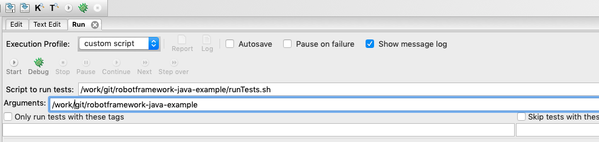

# robotframework-java-example
Example Maven project with Robot Framework tests. Includes also things needed to run tests from RIDE.

## Requirements
This example requires only Java to be installed. Tested with JDK8.

## Running
All tests can be run with:
`mvnw clean verify`

This downloads Maven and executes all tests. For CLI parameters related to Robot Framework check [MavenPlugin-documentation](https://robotframework.org/MavenPlugin/run-mojo.html).

## Running from RIDE
Repository contains also scripts that allow running tests from [RIDE](https://github.com/robotframework/RIDE). Example configuration with Mac (and Linux) below.

## Notes
For some reason listener doesn't seem to be working with RIDE as it did with older versions. 